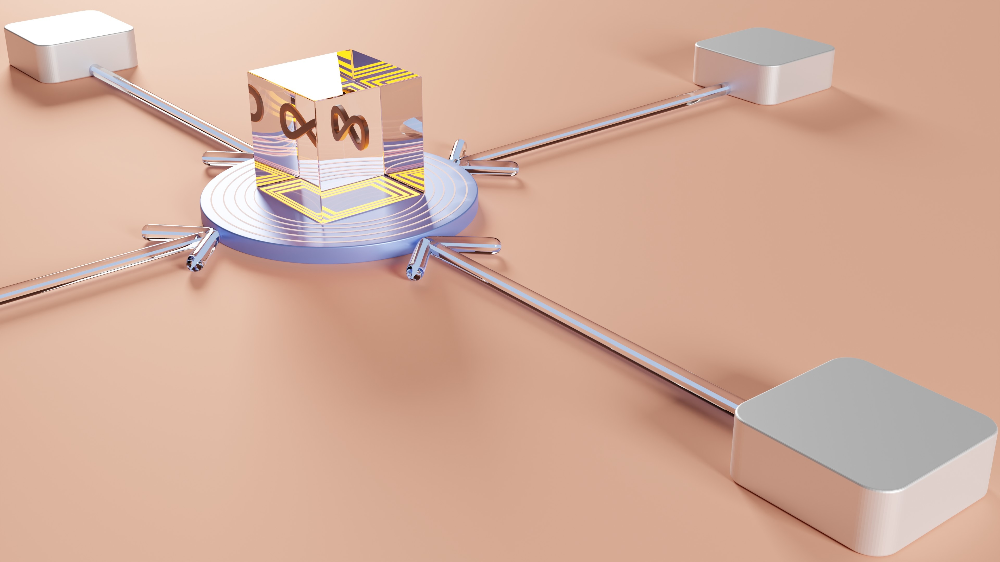

JAMstack ist ein neuer Ansatz für den Aufbau von Websites und Webanwendungen, der viele Vorteile in Sachen Performance, Skalierbarkeit und Entwicklerfreundlichkeit bietet. Dieser Artikel erklärt, was sich hinter JAMstack verbirgt und warum die Architektur die Zukunft des Webs prägen wird.

## Was ist JAMstack?

JAMstack steht für:

- **J**avascript
- **A**PIs
- **M**arkup 

Es handelt sich um eine moderne Webentwicklungsarchitektur, die auf drei Hauptkomponenten basiert:

1. **JavaScript**: Zur Implementierung von Logik und Interaktivität im Frontend.
2. **APIs**: Für serverseitige Funktionen und Datenquellen.
3. **Markup**: Zur Darstellung statischer Inhalte wie HTML, CSS und Bilder.

JAMstack setzt auf die Verwendung von Static Site Generators, die den Markup und die Ressourcen zur Build-Zeit in statische HTML-Seiten umwandeln.

Diese statischen Dateien werden auf Content Delivery Networks (CDNs) gehostet und direkt an die Endbenutzer ausgeliefert. APIs und JavaScript übernehmen die dynamischen Funktionen im Frontend.

## JAMstack - Die Moderne Alternative

JAMstack ist eine zeitgemäße Alternative zur traditionellen Architektur mit serverseitig generiertem HTML:

Anstelle von monolithischen CMS- oder App-Servern setzt JAMstack auf kleinere, eigenständige Services:

- **Git**: Für Versionskontrolle und Zusammenarbeit.
- [**Headless CMS**](/blog/headless-cms-vergleich-der-top-systeme): Für das Content-Management.
- **APIs**: Für Funktionalität.
- **Static Site Generator**: Zur Erstellung statischer HTML-Seiten.
- **CDN**: Zur Verteilung der Inhalte.

## JAMstack - die Prinzipien 

JAMstack folgt Prinzipien, die Performance, Flexibilität und Sicherheit fördern:

### 1. Statische Seiten statt serverseitigem Rendering

Inhalte werden zur Build-Time in statische HTML- und Assets-Dateien konvertiert. Dadurch sind sie schnell auslieferbar und müssen nicht jedes Mal gerendert werden.

### 2. Nutzung von wiederverwendbaren APIs und Services

Anstatt komplexer Applikationen auf dem Server kommen gezielte APIs und Cloud-Services zum Einsatz.

### 3. Loslösung von Frontend und Backend

Die Trennung von statischem Frontend und Backend-Services erlaubt unabhängige Entwicklung und Skalierung.

### 4. Atomarisierung von Technologien 

JAMstack setzt auf kleine, fokussierte Technologien für bestimmte Aufgaben statt Monolith-Architekturen.

### 5. Automatisierte Builds und Deployments 

Tools erlauben das automatische Building, Versionieren und Bereitstellen von Updates.

### 6. Inkrementeller Ansatz

JAMstack erlaubt agile Workflows und inkrementelle Änderungen statt Big Bang Releases.

## Warum JAMstack so schnell ist

Statische JAMstack-Sites sind extrem schnell, da:

- Kein serverseitiges Rendering bei jedem Request nötig ist
- HTML und Assets werden direkt vom CDN geliefert
- JavaScript und CSS können gebündelt und gecacht werden
- Es gibt keine Datenbankabfragen oder andere Latenzen

Tests zeigen, dass JAMstack-Sites um den Faktor 10x schneller sein können als traditionelle Setups.

## Vorteile von JAMstack im Überblick

JAMstack bietet zahlreiche Vorteile:

**Höhere Geschwindigkeit**: Durch Pre-Rendering und CDNs extrem schnelle Performance möglich.

**Niedrigere Kosten**: Einfaches, skalierbares Hosting von statischen Files ist günstig.

**Hohe Sicherheit**: Minimale Angriffsfläche, da keine Applikation auf dem Server ausgeführt wird.

**Optimale Skalierbarkeit**: Beliebiger Traffic kann über CDNs abgefedert werden.

**Agile Entwicklung**: Unabhängige Teams können schnell Änderungen bereitstellen. 

**SEO-Optimierung**: Statische Seiten sind für Suchmaschinen gut zugänglich.

**Einfache Deployments**: Automatisierte Workflows für Build und Upload.

**Globale Verfügbarkeit**: Durch CDNs nahtlos weltweit verfügbar.

**Mehr Flexibilität**: Keine Abhängigkeit von bestimmten Technologien.

**Deutlich weniger technische Schulden**: Moderner Code ohne Legacy-Ballast.

**Zukunftssicherheit**: JAMstack ist für die Herausforderungen des modernen Webs gewappnet.

## Anwendungsfälle für JAMstack

JAMstack eignet sich ideal für:

- Schnelle, sichere Websites jeder Größe
- Web-Apps mit hohem Traffic 
- Webseiten, die globale Reichweite erfordern
- Seiten mit häufigen Updates
- Portale und Blogs
- E-Commerce Websites
- Webseiten, die Offline-Nutzerfreundlichkeit ermöglichen müssen

Im Prinzip kann JAMstack traditionelle Setups in den meisten Anwendungsfällen ersetzen.

## JAMstack mit Headless CMS

Da JAMstack zunächst nur statische Seiten erzeugt, braucht es für dynamische Inhalte ein **Headless CMS**:

Beliebte [Headless CMS](/blog/headless-cms-vergleich-der-top-systeme) sind Contentful, Strapi oder Directus. Über APIs stellt das CMS die Inhalte für das Frontend bereit.

So lassen sich auch große Content-Mengen und häufige Updates abbilden. CMS Funktionen wie Autoren-Rollen bleiben erhalten.

## JAMstack und Serverless Computing

JAMstack kann gut mit Serverless Computing kombiniert werden:

 

Serverlose Funktionen übernehmen dann dynamische Aufgaben wie:

- Benutzerauthentifizierung
- Formularverarbeitung  
- Generieren von PDFs
- Push Benachrichtigungen senden
- Daten aus externen Quellen laden

Beispiele für Serverless-Anbieter sind AWS Lambda, Azure Functions oder Cloudflare Workers.

## Fazit

JAMstack ist eine zukunftsweisende Architektur für schnellere, sicherere und skalierbare Webanwendungen. Durch den Einsatz von CDNs, Headless CMS und fokussierten Services werden ganz neue Möglichkeiten eröffnet.

Die klare Trennung von Frontend und Backend ermöglicht unabhängige Teams, agile Prozesse und inkrementelle Weiterentwicklung. JAMstack ist damit bestens für moderne DevOps Teams und Cloud Infrastrukturen geeignet.

In den meisten Fällen überwiegen die Vorteile traditionelle Web-Stacks. JAMstack ist ein Paradigmenwechsel, der die Art wie wir Websites bauen und hosten nachhaltig verändern wird.
