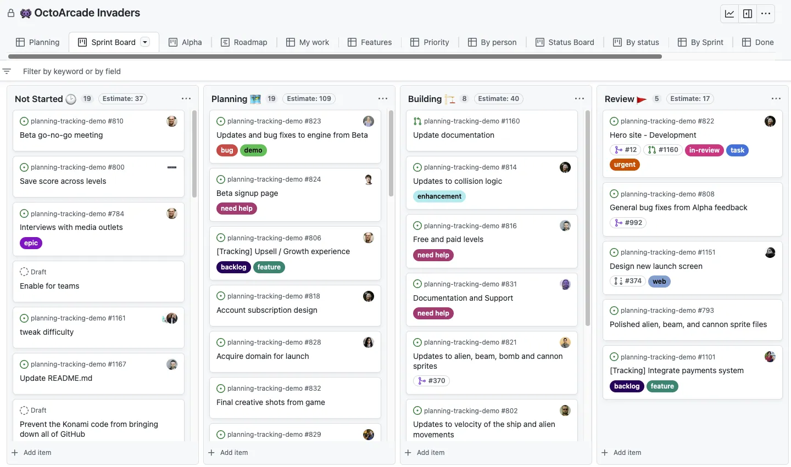

Kanban ist weit mehr als nur das Verschieben von Post-it-Zetteln auf einem Whiteboard. Es ist ein strukturierter Ansatz zur Visualisierung, Priorisierung und Optimierung von Arbeitsprozessen. Kanban kann viele typische Probleme in Unternehmen nachhaltig lösen.

## Was ist Kanban genau?

Kanban ist eine Arbeitsmethode, die einige wesentliche Prinzipien verfolgt:

- **Visualisierung des Workflows**: Der Arbeitsfortschritt wird auf einem Kanban Board visualisiert. Jeder Bearbeitungsschritt bekommt eine Spalte.
- **Begrenzung der Work-In-Progress**: Für jeden Schritt gibt es ein Limit an parallelen Aufgaben, um Überlastung zu vermeiden. 
- **Fokus auf Flow**: Der Fokus liegt auf fließendem Durchlauf der Aufgaben statt Multitasking und Kontextwechseln.
- **Transparenz**: Jeder sieht den Status und kann Engpässe und Blockaden frühzeitig erkennen.  
- **Priorisierung**: Die Aufgaben werden nach Customer Value priorisiert und entsprechend angegangen.
- **Kaizen**: Der Prozess wird kontinuierlich analysiert und inkrementell verbessert.

Kanban deckt die Kapazität und den tatsächlichen Arbeitsfluss ab. So wird Effizienz und Lieferfähigkeit erhöht.

## Typische Arbeitsprobleme, die Kanban lösen kann

Kanban adressiert viele typische Probleme in der Arbeitswelt:

**Überlastung von Mitarbeitern**: Oft werden Aufgaben einfach weitergegeben ohne Rücksicht auf freie Kapazitäten. Kanban verhindert durch Work-in-Progress Limits, dass Mitarbeiter überhäuft werden. Es wird nur angefangen, was auch wirklich abgeschlossen werden kann.

**Schlechte Vorhersehbarkeit von Lieferterminen**: Ohne transparente Übersicht über den Arbeitsstand ist es schwierig, Liefertermine zuverlässig zu prognostizieren. Kanban visualisiert den Workflow und macht ihn vorhersehbar.

**Zu viel Multitasking**: Studien zeigen, dass ständiges Kontextwechseln und das gleichzeitige Bearbeiten vieler Aufgaben ineffizient ist. Kanban sorgt durch WIP-Limits für Fokussierung auf wenige Aufgaben.

**Unerkannte Engpässe**: Ohne transparente Prozessvisualisierung werden Engpässe und Blockaden oft zu spät oder gar nicht erkannt. Kanban macht sie sofort sichtbar.

**Schlechte interdisziplinäre Zusammenarbeit**: Funktionsübergreifende Prozesse mit mehreren Teams sind oft ineffizient und undurchsichtig. Ein Kanban Board kann sämtliche Rollen abbilden.

**Falsche Priorisierung**: Ohne klare Priorisierung leidet die Effizienz und wichtige Aufgaben bleiben liegen. Im Kanban Board ist die Reihenfolge klar. 

**Lange Durchlaufzeiten**: Durch viele Leerlaufzeiten und unnötige Zwischenschritte dauern Abläufe oft zu lange. Kanban minimiert die Zeit von Aufgabenstart bis -ende.

Insgesamt verbessert Kanban damit wesentliche Aspekte wie Effizienz, Transparenz, Kommunikation und Lieferfähigkeit von Arbeitsprozessen.

## Agile Kanban Boards in der Praxis

In der Praxis kommen typischerweise physische oder digitale Kanban Boards zum Einsatz. Jeder Bearbeitungsschritt wird als Spalte dargestellt:

Aufgaben durchlaufen dann von links nach rechts die Workflow-Schritte. In jeder Spalte ist die Anzahl der Aufgaben auf ein vorher festgelegtes Limit beschränkt, um Überlastung zu vermeiden.

Idealerweise finden tägliche Kurz-Meetings vor dem Board statt. Dabei werden der Status besprochen und Aufgaben priorisiert. Anhand von Statistiken zum Durchlauf lassen sich Engpässe identifizieren und der Prozess kontinuierlich optimieren. 

## Kanban Schritt für Schritt im Unternehmen einführen

Bei der Einführung von Kanban sind einige Punkte zu beachten:

**Mit einem einfachen Board starten**: Zu Beginn reichen wenige Schritte wie "Backlog", "In Bearbeitung", "Review" und "Fertig". Später lässt sich das Board erweitern.

**Bestehende Rückstände abbauen**: Bevor neue Aufgaben und Limits hinzukommen, sollte der Rückstau abgearbeitet werden, um einen sauberen Start zu ermöglichen.

**Bereitschaft für Transparenz schaffen**: Mitarbeiter müssen verstehen, dass mehr Transparenz und neue Regeln letztlich allen helfen. Ängste abbauen und Vorteile klar machen. 

**Inkrementell vorgehen und Regeln anpassen**: Lieber mit zu wenig Regeln starten und später basierend auf Daten und Feedback nachjustieren. Dogmatische Vorgaben vermeiden.

**Quick Wins sichtbar machen und Erfolge feiern**: Schon frühe Verbesserungen helfen, alle mitzunehmen und für Kanban zu begeistern. Feedback einholen.

**Top-Down und Bottom-Up**: Das Management muss Kanban vorleben. Aber auch Ideen der Mitarbeitenden einbeziehen, um Akzeptanz zu schaffen.

**Kanban mit Leben füllen**: Nur wenn alle im Team mitziehen und Kanban konsequent umsetzen, werden sich die Vorteile einstellen. Geduld und Beharrlichkeit sind wichtig.

## Workflow-Beispiel: Kanban für Softwareentwicklung 

Schauen wir uns ein konkretes Beispiel für den Einsatz eines Kanban Boards in der Softwareentwicklung an:

Typische Schritte sind hier:

- **Backlog**: Gesamtheit der Anforderungen und von Stakeholdern gewünschte neue Features. 
- **spike**: Kurze Zeitanalyse komplexer Themen um Aufwand abschätzen zu können.
- **To Do**: Konkretisierte und priorisierte Aufgaben, die als nächstes umgesetzt werden.
- **In Progress**: Entwicklung der Lösung. Meist nur 2-3 Aufgaben pro Person gleichzeitig.
- **Review**: Code Review durch andere Entwickler. Defektmanagement und Qualitätssicherung.
- **Testing**: Manuelles Testen, aber auch automatisierte Tests.  
- **Done**: Fertige, abgenommene Lösung. Bereit für den Release.

Im Daily Standup werden Status und Blocker besprochen. Daten zu Durchlaufzeiten und anderen Metriken werden regelmäßig ausgewertet und fließen in Verbesserungen ein.

## Vorteile von Kanban im Überblick

Fassen wir die wesentlichen Vorteile von Kanban in der Arbeitsorganisation nochmals zusammen:

- **Visualisierung**: Der Status aller Aufgaben ist auf einen Blick ersichtlich.

- **Transparenz**: Jeder sieht den Fortschritt und kann selbst priorisieren.

- **Fluss**: Aufgaben werden ohne Leerlauf und Multitasking abgeschlossen. 

- **Flexibilität**: Die Methode kann leicht auf verschiedene Prozesse angepasst werden.

- **Teamwork**: Alle ziehen an einem Strang, Hierarchien verflachen sich.

- **Kaizen**: Kontinuierliche Verbesserung auf Basis von Daten und Feedback.

- **Effizienz**: Verschwendung und Leerlaufzeiten werden deutlich reduziert. 

- **Fokus**: Konzentration auf wenige wichtige Aufgaben vermeidet Ablenkung.

- **Vorhersehbarkeit**: Realistischere Abschätzung von Lieferterminen.  

- **Motivation**: Jeder kann den Fortschritt sehen. Erfolge werden transparent.

Insgesamt hilft Kanban also, typische Probleme in Unternehmen nachhaltig zu beheben und die Arbeitsorganisation zu optimieren.

## Nachteile und Grenzen von Kanban berücksichtigen

Kanban ist sicher hilfreich - aber dennoch kein Allheilmittel für jedes Team und jede Situation. Einige Nachteile und Grenzen sind zu beachten:

- Kanban **ersetzt keine inhaltliche Priorisierung**. Die Mitarbeitenden müssen die Kundenbedürfnisse kennen. 

- Ohne **Commitment im Team** bleibt Kanban nutzloses Werkzeug. Alle müssen mitziehen.

- Komplett **unvorhersehbare** und **unterbrechende Arbeit** lässt sich nicht immer gut abbilden.

- Bei **kreativer Arbeit** kann standardisiertes Vorgehen auch hinderlich sein. Agilität und Flexibilität müssen bleiben.

- Kanban ist kein konkretes Prozessmodell. Die **passende Ausgestaltung** muss gefunden werden.

- Bei großen, komplexen Aufgaben mit vielen Abhängigkeiten stößt Kanban schnell an Grenzen.

Kanban ist also ein nützliches Werkzeug - aber kein Universalmittel, das einfach übergestülpt werden kann. Sorgfältige, auf die Situation abgestimmte Einführung ist entscheidend.

## Fazit: Kanban lohnt sich trotz Einschränkungen 

Trotz gewisser Nachteile und Grenzen ist Kanban in den meisten Fällen eine sehr lohnende Methode, um typische Probleme in der Arbeitswelt zu lösen und Prozesse zu optimieren.

Die Visualisierung, Fokussierung, Transparenz und kontinuierliche Verbesserung sind Schlüsselfaktoren für effizientere Zusammenarbeit. Besonders wissensintensive und kreative Teams können von Kanban profitieren.

Aber die Einführung erfordert Fingerspitzengefühl und sollte inkrementell erfolgen. Nur wenn alle im Team mitziehen, stellen sich die Vorteile von Kanban wirklich ein.

Habt ihr schon Erfahrungen mit Kanban gemacht? In welchen Bereichen konnte es Probleme lösen oder Prozesse verbessern? Ich freue mich auf euren Erfahrungsbericht!