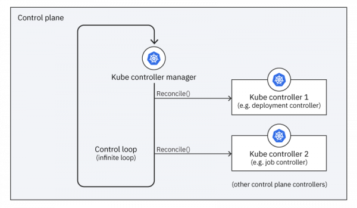

---
title: Writing Custom Kubernetes Controllers in Go
description: A comprehensive guide with code examples on building custom Kubernetes controllers in Go for managing and extending Kubernetes clusters programmatically.
topics:
  - kubernetes
  - golang
  - controllers
  - programming
author: "Julian Köhn"
image:
  url: "../../assets/images/use-scheduler.png"
  alt: "The Astro logo with the word One."
date: 2023-10-20
--- 

# Writing Custom Kubernetes Controllers in Go

Kubernetes controllers are core components that monitor the state of the cluster, make changes attempting to move it towards the desired state, and other housekeeping tasks. 

For example, if you create a new Pod the ReplicaSet controller notices the Pod and creates it. Other common built-in controllers include the Deployment, Job, Node, etc controllers.

In this comprehensive guide you'll learn:

- What Kubernetes controllers are
- When to write a custom controller
- How controllers work under the hood
- Controller patterns and best practices
- Implementing a real-world controller in Go

You'll come away with the skills to build highly tuned controllers tailored for your applications and infrastructure.

## What are Kubernetes Controllers?

Kubernetes controllers are control loops that:

1. Observe cluster state from the API server 
2. Compare actual versus desired state
3. Take action to converge to desired state

For example, a ReplicaSet controller ensures the right number of Pod replicas are running at all times.

If nodes fail or Pods die, the controller will notice the difference between actual and desired state, and create new Pods to match the desired count.

Controllers provide continuous reconciliation. They run non-stop, monitoring state and fixing discrepancies.

Out of the box, Kubernetes provides robust controllers for core entities like Deployments, DaemonSets, StatefulSets, CronJobs, Services, etc. 

But we can also write custom controllers to extend Kubernetes for our own use cases.

## When to Write a Custom Controller

Default controllers cover common needs around workloads, networking, storage, etc. But you may want custom controllers for:

- New resource kinds not in core Kubernetes
- Adding domain-specific logic layered on existing kinds 
- Automating bespoke operational or maintenance tasks
- Integrating Kubernetes with external systems  

Custom controllers are powerful for automating cluster workflows tailored to your infrastructure needs.

Some examples include:

- Auto-scaling GitLab runners on demand
- Draining nodes based on hardware sensors  
- Restricting namespaces based on IAM roles
- Backup/restore/disaster recovery workflows
- Complex job coordination logic

If you find yourself scripting lots of manual Kubernetes tasks, consider consolidating the logic into a dedicated controller.

Next let's look at how controllers work under the hood.

## How Controllers Work

A controller is essentially an automated reconciler between actual and desired system state:



The reconcile loop:

1. **List and watch** for objects of the target kind, e.g. `Pods`
2. For each object, **inspect** its state
3. **Reconcile** actual state with desired state
4. **Update** the object and/or related objects

Controllers continue this loop indefinitely to provide constant reconciliation.

Multiple controller instances may run, competing for objects. The workload is distributed for scalability.

Controller business logic is encapsulated in the **Reconcile()** function. It is invoked on every change, allowing controllers to handle even complex state machines.

Next let's implement a simple controller to see the flow in action.

## Implementing a Simple Controller

To demonstrate core concepts, we'll build a trivial controller to count and log Pod changes:

1. Initialize controller manager
2. List and watch Pods
3. Log Pod creations/deletions 

First install the [controller-runtime](https://github.com/kubernetes-sigs/controller-runtime) library:

```bash
go get sigs.k8s.io/controller-runtime
```

Next create a new Go file `main.go`:

```go
package main

import (
  "context"
  "github.com/kubernetes-sigs/controller-runtime/pkg/client"
  "github.com/kubernetes-sigs/controller-runtime/pkg/manager"
)

func main() {
  // 1. Initialize manager
  mgr, err := manager.New(config, manager.Options{})
  handleErr(err)

  // 2. Create controller
  c := &PodCounter{}

  // 3. Setup reconciler
  err = c.SetupWithManager(mgr)
  handleErr(err)

  // 4. Start manager 
  err = mgr.Start(context.Background())
  handleErr(err)
}
```

This creates a manager and registers our controller.
    
```go
// podcounter_controller.go

type PodCounter struct {
  client.Client
}

func (c *PodCounter) Reconcile(ctx context.Context) error {
  // List Pods
  podList := &corev1.PodList{}
  err := c.List(ctx, podList)
  if err != nil {
    return err 
  }

  // Log number of Pods
  log.Printf("Number of pods: %d", len(podList.Items))

  return nil
}
```

`Reconcile` lists Pods then prints the count.
On each reconcile, it will log the latest Pod number.

To run locally:

```bash
# Setup RBAC
kubectl apply -f config/rbac.yaml

# Run manager 
go run *.go
```

We now have a functioning controller!

With each Pod change, it will re-list and log the count.

Next let's look deeper at real-world patterns.

**Common Controller Patterns**

Here are some best practices for robust production-grade controllers:

**Multiple Queue Keys**

Controllers read object updates from a workqueue. By default, one queue is used. For efficiency, use multiple queues based on key functions:

```go
func (c *Controller) enqueue(obj metav1.Object) {
  // Hash key function
  key := hash(obj) % 10
  
  // Dispatch to queue
  queue := c.workqueues[key]
  queue.Add(obj) 
}
```

This spreads work across queues.

**Limits and Backoffs**
Add work limits and backoff periods to manage queue load:

```go
func (c *Controller) StartWorkers(stopCh <-chan struct{}) {
  // Max threads
  threads := 2

  for i := 0; i < threads; i++ {
    go wait.Until(c.runWorker, time.Second, stopCh) 
  }
}

func (c *Controller) runWorker() {
  for obj := range c.queue.Get() {
    // Max requeues
    if obj.retries >= 3 {  
      c.queue.Forget(obj)
      continue
    } 

    err := c.processItem(obj)
    c.handleErr(err, obj)
    
    // Exponential backoff
    obj.retries++
    c.queue.AddAfter(obj, time.Second*2^obj.retries)
  }
}
```

This prevents overloading and retries gradually.

**Leader Election**
Use leader election to ensure only one controller instance handles reconciliation:

```go
import "github.com/kubernetes-sigs/controller-runtime/pkg/leaderelection"

func main() {
  // Elect leader
  leader, err := leaderelection.NewLeaderElector(election.Options{})

  if !leader.IsLeader() {
    log.Printf("Not leader, skipping reconciliation")
    return
  }
      
  // Run controller   
  mgr, err := manager.New(...)
  //...
}
```

This avoids conflicting changes from multiple controllers.

**Defaulting and Validation**
Consider adding schema defaults and validation:

```go
import apiextensionsv1 "k8s.io/apiextensions-apiserver/pkg/apis/apiextensions/v1"

func (c *Controller) SetupWebhook() {
  schema := apiextensionsv1.CustomResourceValidation{
    OpenAPIV3Schema: &apiextensionsv1.JSONSchemaProps{
      // Specify validations  
      Required: []string{"spec.size"},
      
      Properties: map[string]apiextensionsv1.JSONSchemaProps{
        "spec": {
          Required: []string{"size"},
          
          Properties: map[string]apiextensionsv1.JSONSchemaProps{
            "size": {
              Type:        "string",
              Pattern:     "^[0-9]+Gb$",
              Default:     "10Gb",
            },
          },
        },
      },
    },
  }
  
  // Register webhook
  // ...
}
```

This validates custom resources at admission time.

**Horizontal Scaling**

Control CPU/mem limits and replicas to scale horizontally:

```yaml
# controller.yaml
apiVersion: apps/v1
kind: Deployment 

spec:
  replicas: 3
  
  template:
    spec:
      containers:
      - name: controller
        resources:
          limits:
            cpu: 500m 
            memory: 512Mi
```

Tune resource limits based on usage. Add more replicas as needed.

Proper instrumentation is also key.

With patterns like these, controllers can manage even large clusters efficiently.

**Implementing a Real Controller**
To demonstrate a practical controller, we'll build one to auto-scale GitLab runners on demand.

It will:

- Watch for a ScaleRunner resource
- Scale GitLab runner Deployments based on pending jobs
- Remove idle runners by scaling to 0

**ScaleRunner Object**

```yaml
apiVersion: autoscaling.example.com/v1
kind: ScaleRunner
metadata:
  name: example
spec:
  repo: myorg/myapp
  min: 2
  max: 10
```

**Controller Logic**

```go
import (
  "context"

  autoscalingv1 "autoscaling.example.com/v1

  kbatchv1 "k8s.io/api/batch/v1"
  corev1 "k8s.io/api/core/v1"

  "k8s.io/apimachinery/pkg/api/errors"

  metav1 "k8s.io/apimachinery/pkg/apis/meta/v1"
)

const runnerName = "runner"

func (c *ScaleRunnerController) Reconcile(ctx context.Context) error {
  runner := &ScaleRunner{} 
  name := client.ObjectKey{Namespace: "default", Name: "example"}
  if err := c.Get(ctx, name, runner); err != nil {
    return err
  }

  deploy := &appsv1.Deployment{}
  name = types.NamespacedName{Namespace: "default", Name: runnerName}

  if err := c.Get(ctx, name, deploy); errors.IsNotFound(err) {
    // Create runner deployment
    runnerCount := int32p(runner.Spec.Min)  
    deploy = runnerDeployment(runnerName, runnerCount)

    if err := c.Create(ctx, deploy); err != nil {
      return err 
    }
  }

  // List runner jobs
  jobs := &kbatchv1.JobList{}
  c.List(ctx, jobs, client.InNamespace("default"))

  active := len(jobs.Items)
  desired := int32(active) // Scale based on job count
  
  // Enforce min/max
  desired = max(desired, *runner.Spec.Min)
  desired = min(desired, *runner.Spec.Max)

  // Update deployment
  deploy.Spec.Replicas = &desired

  err := c.Update(ctx, deploy) 
  return err
}

func runnerDeployment(name string, replicas *int32) *appsv1.Deployment {
  // Prepare deployment
  //...

  return deploy
}
```

This scales runner Deployments based on pending jobs.

**Wrap Up**

In this guide we covered:

The role of controllers in Kubernetes
When to implement custom controllers
Controller reconciliation patterns
Building a simple logging controller
Real-world design patterns
Implementing a scaled-down autoscaling controller
Controllers are powerful for encapsulating business logic and automation workflows on Kubernetes.

With core libraries like controller-runtime, writing production-ready controllers is straightforward.

The patterns here will help guide you in developing robust, scalable controllers.

Have you built custom controllers? Share your experiences below!